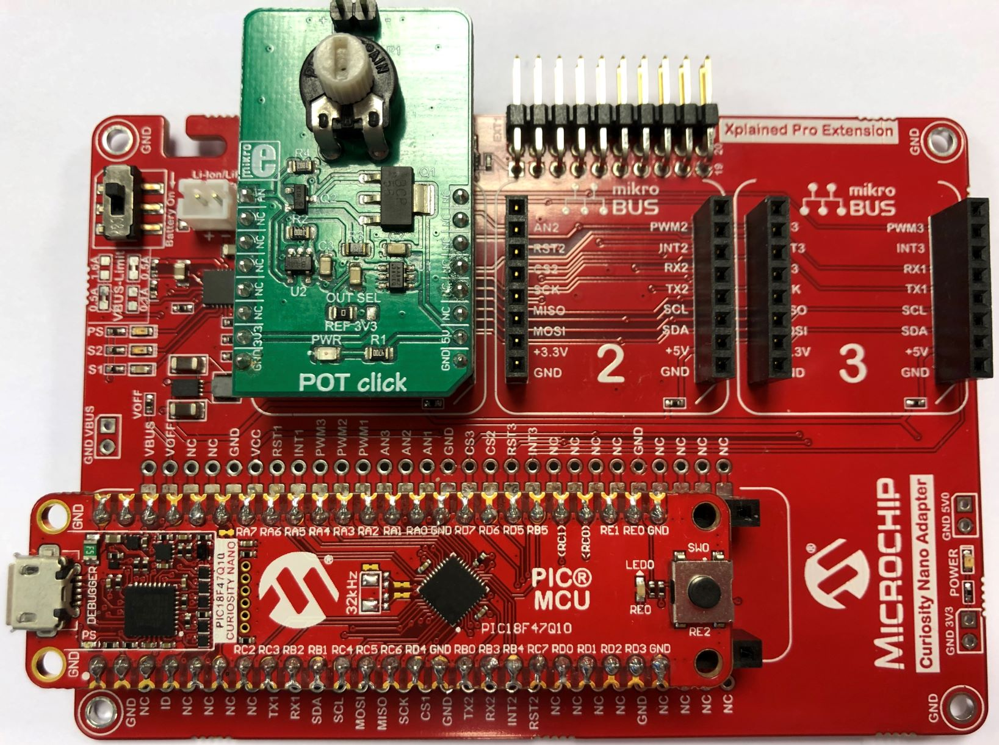

# PIC18F47Q10 Configure TMR4 as HLT to generate an interrupt (like a WDT without reset)

The PIC18F47Q10 features features timers with Hardware Limit Timer (HLT) and a 10-bit ADC with computation (ADCC) module.
In this demo, uses TMR4 peripheral as a HLT in order to generate an interrupt and stop TMR2 that also stops the ADCC auto-conversion.

## Related Documentation
- [TB3285 - Getting Started with Timers/Counters on PIC18](https://www.microchip.com/wwwappnotes/appnotes.aspx?appnote=en1003329)
- [PIC18F47Q10 Product Family Page](https://www.microchip.com/design-centers/8-bit/pic-mcus/device-selection/PIC18F47Q10)
- [PIC18F47Q10 datasheet](http://ww1.microchip.com/downloads/en/DeviceDoc/40002043D.pdf)

## Software Used

- MPLAB® X IDE 5.30 or newer [(microchip.com/mplab/mplab-x-ide)](http://www.microchip.com/mplab/mplab-x-ide)
- MPLAB® XC8 2.10 or newer compiler [(microchip.com/mplab/compilers)](http://www.microchip.com/mplab/compilers)
- MPLAB® Code Configurator (MCC) 3.95.0 or newer [(microchip.com/mplab/mplab-code-configurator)](https://www.microchip.com/mplab/mplab-code-configurator)
- MPLAB® Code Configurator (MCC) PIC10/PIC12/PIC16/PIC18 library v1.79.0 or newer [(microchip.com/mplab/mplab-code-configurator)](https://www.microchip.com/mplab/mplab-code-configurator)

## Hardware Used
- PIC18F47Q10 Curiosity Nano [(DM182029)](https://www.microchip.com/Developmenttools/ProductDetails/DM182029)
- Curiosity Nano Base for Click Boards™ [(AC164162)](https://www.microchip.com/Developmenttools/ProductDetails/AC164162)
- POT click board™ [(MIKROE-3402)](https://www.mikroe.com/pot-click)

## Setup

- The PIC18F47Q10 Curiosity Nano Development Board [(DM182029)](https://www.microchip.com/Developmenttools/ProductDetails/DM182029) is used as the test platform.
- Insert it into the Curiosity Nano Base for Click Boards™ [(AC164162)](https://www.microchip.com/Developmenttools/ProductDetails/AC164162) along with the POT click board™ [(MIKROE-3402)](https://www.mikroe.com/pot-click).
     

The following pin configurations must be made for this project:

|Pin           | Configuration         |
| :----------: | :-------------------: |
|RA0           | Analog input for ADCC |
|RE0           | Digital output (LED0) |
|RC7           | Digital input as HLT trigger |

## Operation
1. Build demo firmware, make and program the generated code onto the PIC18F47Q10 Curiosity Nano.
2. Plug the POT click board™ into the mikroBUS™ slot (1) of the Curiosity Nano Base board.
3. Run the code generated with MCC, LED0 will blink with `Timer2Period` period (100ms).
4. LED0 will blink if Potentiometer value is below `DesiredThreshold`, and if above `DesiredThreshold`, LED0 will be ON.
5. If the ADCC read value is above `MaxThreshold` and RC7 pin is pulled to GND for more than `Timer4Period` (500ms), TMR4 will stop TMR2.
6. LED0 will blink with 500ms period as long as RC7 is tied to GND.
     

## Summary

This project showcases how easy it is to use the TMR4 of PIC18F47Q10 as HLT to generate an interrupt (like a WDT without reset).
